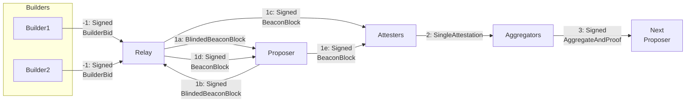
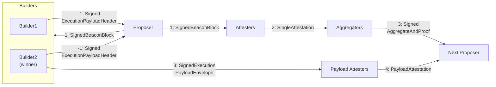

# ePBS / Delayed Executionへの問題提起・改善提案

## Current PBS

slotを3分割で考える。



### -1. SignedBuilderBid

```python
class SignedBuilderBid(Container):
    message: BuilderBid
    signature: BLSSignature
```

```python
class BuilderBid(Container):
    header: ExecutionPayloadHeader
    blob_kzg_commitments: List[KZGCommitment, MAX_BLOB_COMMITMENTS_PER_BLOCK]
    execution_requests: ExecutionRequests # [New in Electra]
    value: uint256
    pubkey: BLSPubkey
```

```python
class ExecutionPayloadHeader(Container):
    parent_hash: Hash32
    fee_recipient: ExecutionAddress
    state_root: Bytes32
    receipts_root: Bytes32
    logs_bloom: ByteVector[BYTES_PER_LOGS_BLOOM]
    prev_randao: Bytes32
    block_number: uint64
    gas_limit: uint64
    gas_used: uint64
    timestamp: uint64
    extra_data: ByteList[MAX_EXTRA_DATA_BYTES]
    base_fee_per_gas: uint256
    block_hash: Hash32
    transactions_root: Root
    withdrawals_root: Root
    # [New in Deneb:EIP4844]
    blob_gas_used: uint64
    # [New in Deneb:EIP4844]
    excess_blob_gas: uint64
```

```python
class ExecutionRequests(Container):
    # [New in Electra:EIP6110]
    deposits: List[DepositRequest, MAX_DEPOSIT_REQUESTS_PER_PAYLOAD]
    # [New in Electra:EIP7002:EIP7251]
    withdrawals: List[WithdrawalRequest, MAX_WITHDRAWAL_REQUESTS_PER_PAYLOAD]
    # [New in Electra:EIP7251]
    consolidations: List[ConsolidationRequest, MAX_CONSOLIDATION_REQUESTS_PER_PAYLOAD]
```

### 1a. BlindedBeaconBlock

```python
class BlindedBeaconBlock(Container):
    slot: Slot
    proposer_index: ValidatorIndex
    parent_root: Root
    state_root: Root
    body: BlindedBeaconBlockBody
```

```python
class BlindedBeaconBlockBody(Container):
    randao_reveal: BLSSignature
    eth1_data: Eth1Data
    graffiti: Bytes32
    proposer_slashings: List[ProposerSlashing, MAX_PROPOSER_SLASHINGS]
    attester_slashings: List[AttesterSlashing, MAX_ATTESTER_SLASHINGS_ELECTRA] # [Modified in Electra:EIP7549]
    attestations: List[Attestation, MAX_ATTESTATIONS_ELECTRA] # [Modified in Electra:EIP7549]
    deposits: List[Deposit, MAX_DEPOSITS]
    voluntary_exits: List[SignedVoluntaryExit, MAX_VOLUNTARY_EXITS]
    sync_aggregate: SyncAggregate
    execution_payload_header: ExecutionPayloadHeader
    bls_to_execution_changes: List[SignedBLSToExecutionChange, MAX_BLS_TO_EXECUTION_CHANGES]
    blob_kzg_commitments: List[KZGCommitment, MAX_BLOB_COMMITMENTS_PER_BLOCK]
    execution_requests: ExecutionRequests # [New in Electra]
```

### 1b. SignedBlindedBeaconBlock

```python
class SignedBlindedBeaconBlock(Container):
    message: BlindedBeaconBlock
    signature: BLSSignature
```

### 1c-1e. SignedBeaconBlock

```python
class SignedBeaconBlock(Container):
    message: BeaconBlock
    signature: BLSSignature
```

```python
class BeaconBlock(Container):
    slot: Slot
    proposer_index: ValidatorIndex
    parent_root: Root
    state_root: Root
    body: BeaconBlockBody
```

```python
class BeaconBlockBody(Container):
    randao_reveal: BLSSignature
    eth1_data: Eth1Data
    graffiti: Bytes32
    proposer_slashings: List[ProposerSlashing, MAX_PROPOSER_SLASHINGS]
    # [Modified in Electra:EIP7549]
    attester_slashings: List[AttesterSlashing, MAX_ATTESTER_SLASHINGS_ELECTRA]
    # [Modified in Electra:EIP7549]
    attestations: List[Attestation, MAX_ATTESTATIONS_ELECTRA]
    deposits: List[Deposit, MAX_DEPOSITS]
    voluntary_exits: List[SignedVoluntaryExit, MAX_VOLUNTARY_EXITS]
    sync_aggregate: SyncAggregate
    execution_payload: ExecutionPayload
    bls_to_execution_changes: List[
        SignedBLSToExecutionChange, MAX_BLS_TO_EXECUTION_CHANGES
    ]
    blob_kzg_commitments: List[KZGCommitment, MAX_BLOB_COMMITMENTS_PER_BLOCK]
    # [New in Electra]
    execution_requests: ExecutionRequests
```

```python
class ExecutionPayload(Container):
    parent_hash: Hash32
    fee_recipient: ExecutionAddress
    state_root: Bytes32
    receipts_root: Bytes32
    logs_bloom: ByteVector[BYTES_PER_LOGS_BLOOM]
    prev_randao: Bytes32
    block_number: uint64
    gas_limit: uint64
    gas_used: uint64
    timestamp: uint64
    extra_data: ByteList[MAX_EXTRA_DATA_BYTES]
    base_fee_per_gas: uint256
    block_hash: Hash32
    transactions: List[Transaction, MAX_TRANSACTIONS_PER_PAYLOAD]
    withdrawals: List[Withdrawal, MAX_WITHDRAWALS_PER_PAYLOAD]
    # [New in Deneb:EIP4844]
    blob_gas_used: uint64
    # [New in Deneb:EIP4844]
    excess_blob_gas: uint64
```

### 2. SingleAttestation

```python
class SingleAttestation(Container):
    committee_index: CommitteeIndex
    attester_index: ValidatorIndex
    data: AttestationData
    signature: BLSSignature
```

```python
class AttestationData(Container):
    slot: Slot
    index: CommitteeIndex
    beacon_block_root: Root
    source: Checkpoint
    target: Checkpoint
```

### 3. SignedAggregateAndProof

```python
class SignedAggregateAndProof(Container):
    # [Modified in Electra:EIP7549]
    message: AggregateAndProof
    signature: BLSSignature
```

```python
class AggregateAndProof(Container):
    aggregator_index: ValidatorIndex
    # [Modified in Electra:EIP7549]
    aggregate: Attestation
    selection_proof: BLSSignature
```

```python
class Attestation(Container):
    # [Modified in Electra:EIP7549]
    aggregation_bits: Bitlist[MAX_VALIDATORS_PER_COMMITTEE * MAX_COMMITTEES_PER_SLOT]
    data: AttestationData
    signature: BLSSignature
    # [New in Electra:EIP7549]
    committee_bits: Bitvector[MAX_COMMITTEES_PER_SLOT]
```


## ePBS

slotを4分割で考える。



||構築者|検証者|
|----|----|----|
|Execution|Builder|Attester(PBS) -> Payload Attester(ePBS)|
|Consensus|Proposer|Attester|

### -1. SignedExecutionPayloadHeader

#### SignedExecutionPayloadHeader

new container
```python
class SignedExecutionPayloadHeader(Container):
    message: ExecutionPayloadHeader
    signature: BLSSignature
```

#### ExecutionPayloadHeader

modified container
```python
class ExecutionPayloadHeader(Container):
    parent_block_hash: Hash32
    parent_block_root: Root
    block_hash: Hash32
    fee_recipient: ExecutionAddress
    gas_limit: uint64
    builder_index: ValidatorIndex
    slot: Slot
    value: Gwei
    blob_kzg_commitments_root: Root
```

(original container)
```python
class ExecutionPayloadHeader(Container):
    parent_hash: Hash32
    fee_recipient: ExecutionAddress
    state_root: Bytes32
    receipts_root: Bytes32
    logs_bloom: ByteVector[BYTES_PER_LOGS_BLOOM]
    prev_randao: Bytes32
    block_number: uint64
    gas_limit: uint64
    gas_used: uint64
    timestamp: uint64
    extra_data: ByteList[MAX_EXTRA_DATA_BYTES]
    base_fee_per_gas: uint256
    block_hash: Hash32
    transactions_root: Root
    withdrawals_root: Root
    # [New in Deneb:EIP4844]
    blob_gas_used: uint64
    # [New in Deneb:EIP4844]
    excess_blob_gas: uint64
```

### 1. SignedBeaconBlock

#### SignedBeaconBlock

indirectly modified container
```python
class SignedBeaconBlock(Container):
    message: BeaconBlock
    signature: BLSSignature
```

#### BeaconBlock

indirectly modified container
```python
class BeaconBlock(Container):
    slot: Slot
    proposer_index: ValidatorIndex
    parent_root: Root
    state_root: Root
    body: BeaconBlockBody
```

#### BeaconBlockBody

modified container
```python
class BeaconBlockBody(Container):
    randao_reveal: BLSSignature
    eth1_data: Eth1Data
    graffiti: Bytes32
    proposer_slashings: List[ProposerSlashing, MAX_PROPOSER_SLASHINGS]
    attester_slashings: List[AttesterSlashing, MAX_ATTESTER_SLASHINGS_ELECTRA]
    attestations: List[Attestation, MAX_ATTESTATIONS_ELECTRA]
    deposits: List[Deposit, MAX_DEPOSITS]
    voluntary_exits: List[SignedVoluntaryExit, MAX_VOLUNTARY_EXITS]
    sync_aggregate: SyncAggregate
    bls_to_execution_changes: List[SignedBLSToExecutionChange, MAX_BLS_TO_EXECUTION_CHANGES]
    # [New in EIP-7732]
    signed_execution_payload_header: SignedExecutionPayloadHeader
    # [New in EIP-7732]
    payload_attestations: List[PayloadAttestation, MAX_PAYLOAD_ATTESTATIONS]
```

(original container)
```python
class BeaconBlockBody(Container):
    randao_reveal: BLSSignature
    eth1_data: Eth1Data
    graffiti: Bytes32
    proposer_slashings: List[ProposerSlashing, MAX_PROPOSER_SLASHINGS]
    # [Modified in Electra:EIP7549]
    attester_slashings: List[AttesterSlashing, MAX_ATTESTER_SLASHINGS_ELECTRA]
    # [Modified in Electra:EIP7549]
    attestations: List[Attestation, MAX_ATTESTATIONS_ELECTRA]
    deposits: List[Deposit, MAX_DEPOSITS]
    voluntary_exits: List[SignedVoluntaryExit, MAX_VOLUNTARY_EXITS]
    sync_aggregate: SyncAggregate
    execution_payload: ExecutionPayload
    bls_to_execution_changes: List[
        SignedBLSToExecutionChange, MAX_BLS_TO_EXECUTION_CHANGES
    ]
    blob_kzg_commitments: List[KZGCommitment, MAX_BLOB_COMMITMENTS_PER_BLOCK]
    # [New in Electra]
    execution_requests: ExecutionRequests
```


### 2. SingleAttestation

Completely the same as PBS

### 3. SignedAggregateAndProof

Completely the same as PBS

### 3. SignedExecutionPayloadEnvelope

#### SignedExecutionPayloadEnvelope

new container
```python
class SignedExecutionPayloadEnvelope(Container):
    message: ExecutionPayloadEnvelope
    signature: BLSSignature
```

#### ExecutionPayloadEnvelope

new container
```python
class ExecutionPayloadEnvelope(Container):
    payload: ExecutionPayload
    execution_requests: ExecutionRequests
    builder_index: ValidatorIndex
    beacon_block_root: Root
    slot: Slot
    blob_kzg_commitments: List[KZGCommitment, MAX_BLOB_COMMITMENTS_PER_BLOCK]
    state_root: Root
```

### 4. 


### BeaconState

modified container

```python
class BeaconState(Container):
    genesis_time: uint64
    genesis_validators_root: Root
    slot: Slot
    fork: Fork
    latest_block_header: BeaconBlockHeader
    block_roots: Vector[Root, SLOTS_PER_HISTORICAL_ROOT]
    state_roots: Vector[Root, SLOTS_PER_HISTORICAL_ROOT]
    historical_roots: List[Root, HISTORICAL_ROOTS_LIMIT]
    eth1_data: Eth1Data
    eth1_data_votes: List[Eth1Data, EPOCHS_PER_ETH1_VOTING_PERIOD * SLOTS_PER_EPOCH]
    eth1_deposit_index: uint64
    validators: List[Validator, VALIDATOR_REGISTRY_LIMIT]
    balances: List[Gwei, VALIDATOR_REGISTRY_LIMIT]
    randao_mixes: Vector[Bytes32, EPOCHS_PER_HISTORICAL_VECTOR]
    slashings: Vector[Gwei, EPOCHS_PER_SLASHINGS_VECTOR]
    previous_epoch_participation: List[ParticipationFlags, VALIDATOR_REGISTRY_LIMIT]
    current_epoch_participation: List[ParticipationFlags, VALIDATOR_REGISTRY_LIMIT]
    justification_bits: Bitvector[JUSTIFICATION_BITS_LENGTH]
    previous_justified_checkpoint: Checkpoint
    current_justified_checkpoint: Checkpoint
    finalized_checkpoint: Checkpoint
    inactivity_scores: List[uint64, VALIDATOR_REGISTRY_LIMIT]
    current_sync_committee: SyncCommittee
    next_sync_committee: SyncCommittee
    latest_execution_payload_header: ExecutionPayloadHeader
    next_withdrawal_index: WithdrawalIndex
    next_withdrawal_validator_index: ValidatorIndex
    historical_summaries: List[HistoricalSummary, HISTORICAL_ROOTS_LIMIT]
    deposit_requests_start_index: uint64
    deposit_balance_to_consume: Gwei
    exit_balance_to_consume: Gwei
    earliest_exit_epoch: Epoch
    consolidation_balance_to_consume: Gwei
    earliest_consolidation_epoch: Epoch
    pending_deposits: List[PendingDeposit, PENDING_DEPOSITS_LIMIT]
    pending_partial_withdrawals: List[PendingPartialWithdrawal, PENDING_PARTIAL_WITHDRAWALS_LIMIT]
    pending_consolidations: List[PendingConsolidation, PENDING_CONSOLIDATIONS_LIMIT]
    # [New in EIP-7732]
    builder_pending_payments: Vector[BuilderPendingPayment, 2 * SLOTS_PER_EPOCH]
    # [New in EIP-7732]
    builder_pending_withdrawals: List[BuilderPendingWithdrawal, BUILDER_PENDING_WITHDRAWALS_LIMIT]
    # [New in EIP-7732]
    latest_block_hash: Hash32
    # [New in EIP-7732]
    latest_full_slot: Slot
    # [New in EIP-7732]
    latest_withdrawals_root: Root
```

(original container)
```python
class BeaconState(Container):
    genesis_time: uint64
    genesis_validators_root: Root
    slot: Slot
    fork: Fork
    latest_block_header: BeaconBlockHeader
    block_roots: Vector[Root, SLOTS_PER_HISTORICAL_ROOT]
    state_roots: Vector[Root, SLOTS_PER_HISTORICAL_ROOT]
    historical_roots: List[Root, HISTORICAL_ROOTS_LIMIT]
    eth1_data: Eth1Data
    eth1_data_votes: List[Eth1Data, EPOCHS_PER_ETH1_VOTING_PERIOD * SLOTS_PER_EPOCH]
    eth1_deposit_index: uint64
    validators: List[Validator, VALIDATOR_REGISTRY_LIMIT]
    balances: List[Gwei, VALIDATOR_REGISTRY_LIMIT]
    randao_mixes: Vector[Bytes32, EPOCHS_PER_HISTORICAL_VECTOR]
    slashings: Vector[Gwei, EPOCHS_PER_SLASHINGS_VECTOR]
    previous_epoch_participation: List[ParticipationFlags, VALIDATOR_REGISTRY_LIMIT]
    current_epoch_participation: List[ParticipationFlags, VALIDATOR_REGISTRY_LIMIT]
    justification_bits: Bitvector[JUSTIFICATION_BITS_LENGTH]
    previous_justified_checkpoint: Checkpoint
    current_justified_checkpoint: Checkpoint
    finalized_checkpoint: Checkpoint
    inactivity_scores: List[uint64, VALIDATOR_REGISTRY_LIMIT]
    current_sync_committee: SyncCommittee
    next_sync_committee: SyncCommittee
    latest_execution_payload_header: ExecutionPayloadHeader
    next_withdrawal_index: WithdrawalIndex
    next_withdrawal_validator_index: ValidatorIndex
    historical_summaries: List[HistoricalSummary, HISTORICAL_ROOTS_LIMIT]
    deposit_requests_start_index: uint64
    deposit_balance_to_consume: Gwei
    exit_balance_to_consume: Gwei
    earliest_exit_epoch: Epoch
    consolidation_balance_to_consume: Gwei
    earliest_consolidation_epoch: Epoch
    pending_deposits: List[PendingDeposit, PENDING_DEPOSITS_LIMIT]
    pending_partial_withdrawals: List[
        PendingPartialWithdrawal, PENDING_PARTIAL_WITHDRAWALS_LIMIT
    ]
    pending_consolidations: List[PendingConsolidation, PENDING_CONSOLIDATIONS_LIMIT]
```


## Jul 7 Discussion with Tei
Teiの疑問

- 勝者Builderがpayloadをwithholdするインセンティブがあるか？
    - かなり難しそう
- 勝者Builderがpayload公開を遅らせるインセンティブがあるか？
    - 情報の非対称性を長く保つことができる
    - そのブロックによる状態遷移を知っている時間を長くできる
    - Ethereumでdiscoveryが起きる対象(取引量が小さいペア)について、CEX(L2)で価格が変動するけど、CEXとかで先に反対注文しておける
    - オフチェーン世界を探る with Alpha
    - discoveryの対象が思ったより広ければ、、、？
    - 遅らせれば遅らせるほど次のブロック構築を邪魔できる
    - 遅らせれば遅らせるほどユーザーのconfirmationが遅くなる
      (potuzはconfirmation今よりあんま変わらんと言ってる)
- boostの値が変わる場合reorg attackのしきい値が変わる、結果的にRANDAO forking attackのしきい値も変わる
- 他にもあれば

調べとくこと
- builderの残高はどう管理されてるか？報酬はどう支払われているか？
- delayed execution, txやreceiptのtreeに関してはどうなっているのか？
- 現状の議論(メリットデメリット)をまとめる
    - まずはSlot Restructuring読む
    - 後はtwitter, discord, ZuBerlin session, EthCC追う
- EIP7732/EIP7886がGlamsterdamに含まれるかどうかの決定がいつか調べる

## Jul 8 Discussion with Alpha
