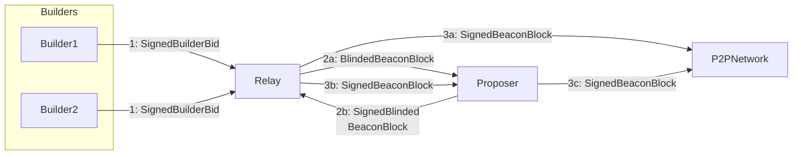
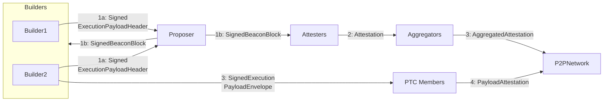

# ePBS / Delayed Executionへの問題提起・改善提案

## Current PBS


### 1. SignedBuilderBid

```python
class SignedBuilderBid(Container):
    message: BuilderBid
    signature: BLSSignature
```

```python
class BuilderBid(Container):
    header: ExecutionPayloadHeader
    blob_kzg_commitments: List[KZGCommitment, MAX_BLOB_COMMITMENTS_PER_BLOCK]
    execution_requests: ExecutionRequests # [New in Electra]
    value: uint256
    pubkey: BLSPubkey
```

### 2. BlindedBeaconBlock, SignedBlindedBeaconBlock

```python
class BlindedBeaconBlock(Container):
    slot: Slot
    proposer_index: ValidatorIndex
    parent_root: Root
    state_root: Root
    body: BlindedBeaconBlockBody
```

```python
class BlindedBeaconBlockBody(Container):
    randao_reveal: BLSSignature
    eth1_data: Eth1Data
    graffiti: Bytes32
    proposer_slashings: List[ProposerSlashing, MAX_PROPOSER_SLASHINGS]
    attester_slashings: List[AttesterSlashing, MAX_ATTESTER_SLASHINGS_ELECTRA] # [Modified in Electra:EIP7549]
    attestations: List[Attestation, MAX_ATTESTATIONS_ELECTRA] # [Modified in Electra:EIP7549]
    deposits: List[Deposit, MAX_DEPOSITS]
    voluntary_exits: List[SignedVoluntaryExit, MAX_VOLUNTARY_EXITS]
    sync_aggregate: SyncAggregate
    execution_payload_header: ExecutionPayloadHeader
    bls_to_execution_changes: List[SignedBLSToExecutionChange, MAX_BLS_TO_EXECUTION_CHANGES]
    blob_kzg_commitments: List[KZGCommitment, MAX_BLOB_COMMITMENTS_PER_BLOCK]
    execution_requests: ExecutionRequests # [New in Electra]
```

```python
class SignedBlindedBeaconBlock(Container):
    message: BlindedBeaconBlock
    signature: BLSSignature
```

### 3. SignedBeaconBlock

```python
class SignedBeaconBlock(Container):
    message: BeaconBlock
    signature: BLSSignature
```

```python
class BeaconBlock(Container):
    slot: Slot
    proposer_index: ValidatorIndex
    parent_root: Root
    state_root: Root
    body: BeaconBlockBody
```

```python
class BeaconBlockBody(Container):
    randao_reveal: BLSSignature
    eth1_data: Eth1Data
    graffiti: Bytes32
    proposer_slashings: List[ProposerSlashing, MAX_PROPOSER_SLASHINGS]
    # [Modified in Electra:EIP7549]
    attester_slashings: List[AttesterSlashing, MAX_ATTESTER_SLASHINGS_ELECTRA]
    # [Modified in Electra:EIP7549]
    attestations: List[Attestation, MAX_ATTESTATIONS_ELECTRA]
    deposits: List[Deposit, MAX_DEPOSITS]
    voluntary_exits: List[SignedVoluntaryExit, MAX_VOLUNTARY_EXITS]
    sync_aggregate: SyncAggregate
    execution_payload: ExecutionPayload
    bls_to_execution_changes: List[
        SignedBLSToExecutionChange, MAX_BLS_TO_EXECUTION_CHANGES
    ]
    blob_kzg_commitments: List[KZGCommitment, MAX_BLOB_COMMITMENTS_PER_BLOCK]
    # [New in Electra]
    execution_requests: ExecutionRequests
```

## ePBS



## Jul 7
Teiの疑問

- 勝者Builderがpayloadをwithholdするインセンティブがあるか？
    - かなり難しそう
- 勝者Builderがpayload公開を遅らせるインセンティブがあるか？
    - 情報の非対称性を長く保つことができる
    - そのブロックによる状態遷移を知っている時間を長くできる
    - Ethereumでdiscoveryが起きる対象(取引量が小さいペア)について、CEX(L2)で価格が変動するけど、CEXとかで先に反対注文しておける
    - liquidation？などオフチェーン世界を探る with Alpha
    - discoveryの対象が思ったより広ければ、、、？
    - 遅らせれば遅らせるほど次のブロック構築を邪魔できる
    - 遅らせれば遅らせるほどユーザーのconfirmationが遅くなる
      (potuzはconfirmation今よりあんま変わらんと言ってる)
- boostの値が変わる場合reorg attackのしきい値が変わる、結果的にRANDAO forking attackのしきい値も変わる
- 他にもあれば

調べとくこと
- builderの残高はどう管理されてるか？報酬はどう支払われているか？
- delayed execution, txやreceiptのtreeに関してはどうなっているのか？
- 現状の議論(メリットデメリット)をまとめる
    - まずはSlot Restructuring読む
    - 後はtwitter, discord, ZuBerlin session, EthCC追う
- EIP7732/EIP7886がGlamsterdamに含まれるかどうかの決定がいつか調べる

## Jul 8
